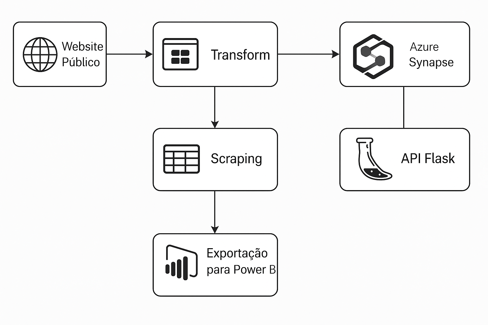

## Visão Geral
Este projeto automatiza a coleta de informações de um site público, converte os dados para um formato tabular limpo, grava‐os em um data warehouse no Azure Synapse Analytics, publica uma API REST em Flask para consumo externo e gera um arquivo (CSV/Parquet) atualizado que pode ser usado como fonte no Power BI.
## Objetivos
- Coletar dados atualizados do site a cada hora	<5 min por execução
- Disponibilizar dados normalizados em Synapse	100 % de linhas válidas
- Expor API pública de leitura	P95 latency < 200 ms
- Atualizar arquivo de exportação para Power BI	Novas versões em até 10 min pós‐coleta
## Tecnologias
- Scraping	Python 3.12, Requests, BeautifulSoup4, AsyncIO/AioHTTP
- Orquestração	Azure Data Factory ou Apache Airflow
- Transformação	PySpark (Azure Databricks) ou Synapse Spark
- Armazenamento intermediário	Azure Blob Storage (Data Lake Gen2)
- DW	Azure Synapse SQL Dedicated (ou Serverless)
- API	Flask + Gunicorn, hospedado em Azure App Service (Linux)
- Exportação	Pandas → CSV/Parquet em Blob; Conexão “Azure Data Lake Gen2” no Power BI
- Observabilidade	Azure Monitor, Log Analytics, Application Insights
- CI/CD	Azure DevOps Pipelines ou GitHub Actions + bicep/terraform
## Arquitetura

## Documentações Utilizadas
https://pypi.org/project/beautifulsoup4

https://docs.databricks.com/aws/en/archive/azure/stream-synapse
#
#
#

## Overview
This project automates the collection of information from a public website, converts the data into a clean tabular format, writes it to a data warehouse in Azure Synapse Analytics, publishes a Flask REST API for external consumption, and generates an updated file (CSV/Parquet) that can be used as a source in PowerBI.
## Objectives
- Collect updated data from the website every hour < 5 minutes per run
- Make normalized data available in Synapse with 100% of valid rows
- Expose public read API with P95 latency < 200 ms
- Update the export file to PowerBI with new versions within 10 minutes of collection
## Technologies
- Python3.12 Scraping, Requests, BeautifulSoup4, AsyncIO/AioHTTP
- Azure Data Factory or Apache Airflow Orchestration
- PySpark (Azure Databricks) or Synapse Spark Transformation
- AzureBlob Storage (Data Lake Gen2) Intermediate Storage
- Azure Synapse SQL Dedicated DW (or Serverless)
- Flask + Gunicorn API, hosted on Azure App Service (Linux)
- Pandas → CSV/Parquet to Blob export; "AzureDataLake Gen2" connection in PowerBI
- Azure Monitor Observability, Log Analytics, Application Insights
- CI/CD Azure DevOps Pipelines or GitHub Actions + bicep/terraform
## Architecture

## Documentation Used
https://pypi.org/project/beautifulsoup4

https://docs.databricks.com/aws/en/archive/azure/stream-synapse
